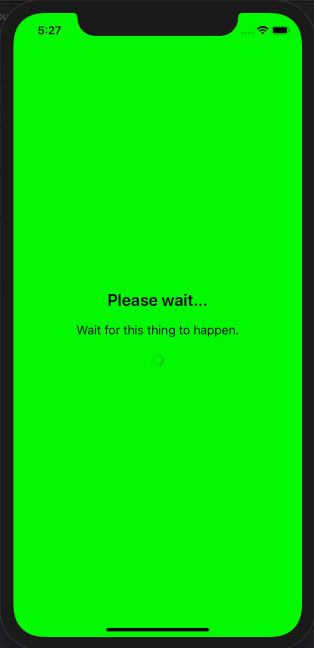

[](https://travis-ci.com/levibostian/PleaseHold-iOS)
[](https://cocoapods.org/pods/PleaseHold)
[](https://cocoapods.org/pods/PleaseHold)
[](https://cocoapods.org/pods/PleaseHold)


# PleaseHold

Quick and easy progress UIView to place in your app.

*Android developer? Check out [the Android version of PleaseHold!](https://github.com/levibostian/pleasehold-android)*

## What is PleaseHold?

In the moments when you need to show a blocking progress UIView in your app, PleaseHold is a quick way to put one in your app. Configured with default settings that will work for most use cases, but customizable enough to cover more. Do us all a favor, and avoid blocking views as much as you can 😉.



## Why use PleaseHold?

* Swift API
* Lightweight. Zero dependencies. 
* UI testing friendly. 
* Setup with default values that should work for 95% of your use cases. Customizable for those other cases. 
* Full test suite. [](https://travis-ci.com/levibostian/PleaseHold-iOS)
* [Full documentation](https://levibostian.github.io/PleaseHold-iOS/). 

I recommend you check out 2 other libraries that work nicely with PleaseHold: [Empty](https://github.com/levibostian/Empty-iOS) and [Swapper](https://github.com/levibostian/Swapper-iOS).

## Installation

PleaseHold is available through [CocoaPods](https://cocoapods.org/pods/PleaseHold). To install it, simply add the following line to your Podfile:

```ruby
pod 'PleaseHold', '~> version-here'
```

Replace `version-here` with: [](https://cocoapods.org/pods/PleaseHold) as this is the latest version at this time. 

# Getting started

* Create an instance of `PleaseHoldView` in your `UIViewController`. You can do this with Storyboard by adding a `UIView` to Storyboard and setting the `UIView` class to `PleaseHoldView`, or create an instance in your Swift code:

```swift
let pleaseHoldView: PleaseHoldView = {
    let view = PleaseHoldView()
    view.title = nil // title is optional 
    view.message = nil // message is optional 
    view.translatesAutoresizingMaskIntoConstraints = false    
    return view
}()
```

* Add the `PleaseHoldView` to your `UIViewController`. Pretty simple. 

If you want to change the text of the title or message `UILabel`s, you can change them at runtime:

```swift
pleaseHoldView.title = "New title"
pleaseHoldView.message = "New message"
```

Or, if you want to hide one of the labels, you can just set `nil`:

```swift
pleaseHoldView.title = nil 
pleaseHoldView.message = nil 
```

# Configure PleaseHold 

PleaseHold works great without any configuration necessary. However, if you wish to customize it yourself, you can. 

If you want to change the default values of all instances of `PleaseHold` in your app, change the values in the default singleton:

```swift
PleaseHold.defaultConfig.viewPadding = 10.0
```

Or, you can configure 1 single instance of `PleaseHold`:

```swift
let pleaseHoldView = PleaseHoldView()
pleaseHoldView.config.newTitleLabel = {
    let label = PleaseHoldViewConfig.defaultTitleLabel
    label.textColor = .blue
    return label
}
pleaseHoldView.title = "Set title here, it will have blue text color!"
```

To make re-useable configurations for `PleaseHoldView`, it's recommended to create an `PleaseHoldViewConfigPresent`:

```swift
/// Convenient set of `UIView`s that are dark in color. Great for light colored backgrounds.
public struct DarkPleaseHoldViewConfigPreset: PleaseHoldViewConfigPreset {
    /// Dark colored title label.
    public var titleLabel: UILabel {
        let label = PleaseHoldViewConfig.defaultTitleLabel
        label.textColor = .darkText
        return label
    }

    /// Dark colored message label.
    public var messageLabel: UILabel {
        let label = PleaseHoldViewConfig.defaultMessageLabel
        label.textColor = .darkText
        return label
    }

    /// Dark colored activity indicator.
    public var activityIndicator: UIActivityIndicatorView {
        let indicator = PleaseHoldViewConfig.defaultActivityIndicator
        indicator.style = .gray
        return indicator
    }
}

let pleaseHoldView = PleaseHoldView()
pleaseHoldView.config = DarkPleaseHoldViewConfigPreset().config
```

For convenience, `PleaseHold` comes with a light and dark colored present: `DarkPleaseHoldViewConfigPreset` and `LightPleaseHoldViewConfigPreset` that you can use or extend. 

There are many things you can configure for `PleaseHold`. For a list of all the configuration options, view the [docs on PleaseHoldViewConfig](https://levibostian.github.io/PleaseHold-iOS/Classes/PleaseHoldViewConfig.html)

## Example

PleaseHold comes with an example app you can use to play with the library. To run the example project, clone the repo, and run `pod install` from the Example directory first. Then, open the workspace in XCode. 

## Development 

PleaseHold is a pretty simple CocoaPods library project. Follow the directions below for the optimal development experience. 

* Install cocoapods/gems and setup workspace:

```bash
$> bundle install
$> cd PleaseHold/Example
$> pod install
```

* Setup git hooks [via overcommit](https://github.com/brigade/overcommit/) to run misc tasks for you when using git. 

```bash
$> overcommit --install
```

## Author

* Levi Bostian - [GitHub](https://github.com/levibostian), [Twitter](https://twitter.com/levibostian), [Website/blog](http://levibostian.com)


## Contribute

PleaseHold is open for pull requests. Check out the [list of issues](https://github.com/levibostian/PleaseHold-ios/issues) for tasks I am planning on working on. Check them out if you wish to contribute in that way.

**Want to add features to PleaseHold?** Before you decide to take a bunch of time and add functionality to the library, please, [create an issue](https://github.com/levibostian/PleaseHold-iOS/issues/new) stating what you wish to add. This might save you some time in case your purpose does not fit well in the use cases of PleaseHold.

## License

PleaseHold is available under the MIT license. See the LICENSE file for more info.
